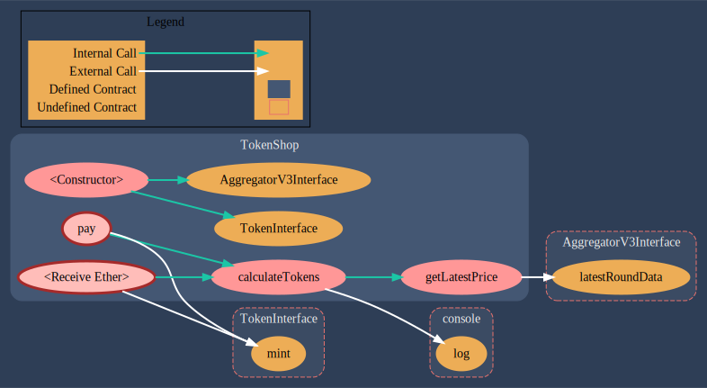

# TOKEN SHOP WITH CHAINLINK PRICE FEEDS

This project demonstrates

- the creation of a ERC20 token with Role Based Access Control.
- the use of Chainlink Price feeds to calculate the exchange rate of ETH/USD as the price of the ERC20 token is denominated in USD and the buyer account will send in ETH. So the ETH needs to be convered to USD to calculate how much of the ERC20 token needs to be minted for the buyer.
- > :warning: TODO@zubinpratap Hardhat testing on the local hardhat network
- Deployment of tested contracts to Goerli.

# Structure

- `Token.sol` implements an ERC20 Token that inherits OpenZeppelin's Ownable Contract. By default the deploying address is the Owner of the Token contract.
- `TokenShop.sol` is what receives ETH from buyers, and then calls on `TokenMinter` to transfer the appropriate number of tokens (to 18 decimals) to the buyer. This contract also gets the ETH/USD price from Chainlink Pricefeeds, and uses that to calculate how many of the tokens the buyer will get based on the current USD value of the ETH they pay.

**TokenShop's Call Graph**

# Deployment steps

1. Deploy the Token contract
2. Deploy the TokenMinter contract, which takes Token's address as a param.
3. Deploy the TokenShop contract which takes TokenMinter as a param.

4. Using an [ether unit converter site](https://goerli.etherscan.io/unitconverter) choose an amount in wei. For eg 1.7 ether, which is 1700000000000000000 wei.
5. On the TokenShop contract check that the `getLatestPrice()` with Chainlink Price feeds is working by calling it. You should get an integer that is the ETH/USD price, with 8 decimals, made into a whole integer by multiplying with 1e8. (ETH/USD means 1 ETH has a USD value of ....)
6. Call `.Pay()` on TokenShop and pass `1700000000000000000` wei as the value. This call should fail because the TokenMinter is not yet the Owner of the Token contract... the address that deployed the Token contract is still the owner. The error message should mention that the caller (TokenMinter) is not the Owner of the Ownable Token contract.
7. In the Token contract, call `.owner()`. It will be the address that deployed it.
8. Call `.balanceOf()` in the Token and pass the deploying address or any address. It should be `0` as no tokens have been minted to that, or any, address yet.

9. Call `.transferOwnership()` in the Token contract and pass it the address of the TokenMinter. Check that the new `.owner()` returns the TokenMinter.
10. Go back to TokenShop and call `.Pay()` again with `1700000000000000000` wei as value. This time, the transaction should succeed. Check by going back to Token and calling `balanceOf()` with the address that called `.Pay()`. It should produce a number which when divided by 1e18 (10 ^ 18) will produce the number of tokens you minted.
11. Optionally, you can call `.transferOwnership()` but from inside the TokenMinter contract, to transfer ownership back to another address/ the deployer address.

# LIVE TESTNET DEPLOYMENTS ON GOERLI
Date: 5 September 2022 AEST.

- SmartConToken: `0x553b7d2C667DE57cc47446442b13657100D3c882`
- TokenMinter: `0x773bd17315A4c36860fe025439aCedc32ECb1Cd5`
- TokenShop: `0x6b5bC0CB8b820AB6f19C5F13937726c02d54D7f1`

> :warning: WARNING!:  
> - these contract numbers will change every time we run `yarn hardhat deploy --network goerli`.  The contract addresses get stored in the JSON metadata in the `/deployments/goerli` folder and get reused by calls to `getContract()`.
> - The staging/integration tests are written as though a fresh deploy is made every time. Fresh deploys are needed because we are making changes to contracts that need to be integrated tested.

